9. Practical Python -- Advanced Topics
======================================

Overview

By the end of this lab, you will be able to, write Python
collaboratively as a member of a team; use conda to document and set up
the dependencies for your Python programs; use Docker to create
reproducible Python environments to run your code; write programs that
take advantage of multiple cores in modern computers; write scripts that
can be configured from the command line and explain the performance
characteristics of your Python programs, and use tools to make your
programs faster.


Introduction
============


In this lab, you\'ll continue the move which started in *Lab 8*,
*Software Development*, away from your individual focus on learning the
syntax of the Python language toward becoming a contributing member of a
Python development team. Large projects solving complex problems need
expertise from multiple contributors, so it\'s very common to work on
code with one or more colleagues as a developer community. Having
already seen how to use `git` version control in *Lab 8*,
*Software Development*, you\'ll apply that knowledge in this lab to
working with teams. You\'ll be using GitHub, branches, and
`pull` requests in order to keep your project in sync.

Moving on, in the IT world, when you deliver a certain project, at some
point, you\'ll want to deliver your code to your customers or
stakeholders. An important part of the deployment process is making sure
that the customer\'s system has the libraries and modules that your
software needs, and also the same versions that you were developing
against. For this, you\'ll learn how to use `conda` to create
baseline Python environments with particular libraries present, and how
to replicate those environments on another system.

Next, you will look at Docker, which is a popular way to deploy software
to internet servers and cloud infrastructure. You\'ll learn how to
create a container that includes your `conda` environment and
your Python software, and how to run the containerized software within
Docker.

Finally, you\'ll learn some useful techniques for developing real-world
Python software. These include learning how to take advantage of
parallel programming, how to parse command-line arguments, and how to
profile your Python to discover and fix performance problems.


Developing Collaboratively
==========================


In *Lab 8*, *Software Development*, you used `git` to keep
track of the changes you made to your Python project. At its heart,
membership of a programming team involves multiple people sharing their
changes through `git` and ensuring that you are incorporating
everybody else\'s changes when doing your own work.

There are many ways for people to work together using `git`.
The developers of the Linux kernel each maintain their own repository
and share potential changes over email, which they each choose whether
to incorporate or not. Large companies, including Facecourse and Google,
use *trunk-based development*, in which all changes must be made on the
main branch, usually called the \"*master*.\"

A common workflow popularized by support in the GitHub user interface is
the `pull` request.

In the `pull` request workflow, you maintain your repository
as a `fork` in GitHub of the canonical version from which
software releases are made, often referred to as `upstream` or
`origin`. You make a small collection of related changes, each
representing progress toward a single bug fix or new feature, in a named
branch on your own repository, which you push to your hosted repository
with `git` `push`. When you are ready, you submit a
`pull` request to the upstream repository. The team reviews
these changes together in the `pull` request, and you add any
further work needed to the branch. When the team is happy with the
`pull` request, a supervisor or another developer merges it
upstream, and the changes are \"pulled\" into the canonical version of
the software.

The advantage of the `pull` request workflow is that it\'s
made easy by the user interface in applications such as Bitbucket,
GitHub, and GitLab. The disadvantage comes from keeping those branches
around while the `pull` request is being created and is under
review. It\'s easy to fall behind as other work goes into the upstream
repository, leaving your branch out of date and introducing the
possibility that your change will conflict with some other changes, and
those conflicts will need a resolution.

To deal with fresh changes and conflicts as they arise, rather than as a
huge headache when it comes time to merge the `pull` request,
you use `git` to fetch changes from the upstream repository,
and either merge them into your branch or rebase your branch on the
up-to-date upstream revision. Merging combines the history of commits on
two branches and rebasing reapplies commits such that they start at the
tip of the branch you are rebasing against. Your team should decide
which of these approaches they prefer.


Exercise 117: Writing Python on GitHub as a Team
------------------------------------------------

In this exercise, you will learn how to host code on GitHub, make a
`pull` request, and then approve changes to the code. To make
this exercise more effective, you can collaborate with a friend.

1.  If you don\'t have an account already, create one on
    [github.com](http://github.com/).

2.  Log into <https://github.com/> and create a new repository by
    clicking on **New**:

    
    


    Figure 9.1: The GitHub home page

3.  Give the repository an appropriate name, such as
    `python-demo`, and click on **Create**.

4.  Now click on **Clone or download,** and you will be able to see the
    HTTPS URL; however, note that we will need the SSH URL. Hence, you
    will see **Use SSH** on the same tab, which you need to click on:

    
    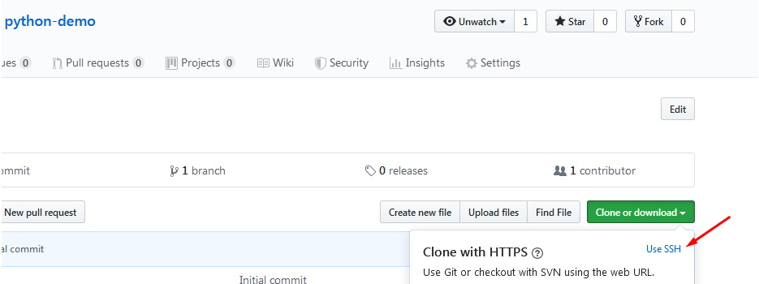


    Figure 9.2: Using SSH URL on GitHub

5.  Now copy the `SSH URL` on GitHub. Then, using your local
    Command Prompt, such as `CMD` in Windows, clone the
    repository:


    ```
    git clone git@github.com:andrewbird2/python-demo.git
    ```

    Note

    Your command will look slightly different from the preceding command
    because of the different username. You need to add your SSH URL
    after `git clone`. Note that you may also need to add an
    SSH key to your GitHub account for authentication. If so, follow the
    instructions here to add the SSH key:

    https://docs.github.com/en/enterprise/2.16/user/github/authenticating-to-github/generating-a-new-ssh-key-and-adding-it-to-the-ssh-agent

6.  In your new `python-demo` directory, create a Python file.
    It doesn\'t matter what it contains; for instance, create a simple
    one-line `test.py` file, as shown in the following code
    snippet:

    ```
    echo "x = 5" >> test.py
    ```

7.  Let\'s `commit` our changes:


    ```
    git add .
    git commit -m "Initial"
    git push origin master
    ```

    You should get the following output:

    
    


    Figure 9.3: Pushing our initial commit

    At this point, if you are working with someone else, clone their
    repository, and perform the following steps on their code base to
    experience what collaboration feels like. If working alone, just
    proceed with your own repository.

8.  Create a new branch called `dev`:


    ```
    git checkout -b dev
    ```

    You should get the following output:

    
    


    Figure 9.4: Creating a dev branch

9.  Create a new file called `hello_world.py`. This can be
    done in a text editor, or with the following simple command:

    ```
    echo "print("Hello World!")" >> hello_world.py
    ```

10. `commit` the new file to the `dev` branch and
    `push` it to the created `python-demo`
    repository:

    ```
    git add .
    git commit -m "Adding hello_world"
    git push --set-upstream origin dev
    ```

11. Go to the project repository in your web browser and click on
    **Compare & pull request**:

    
    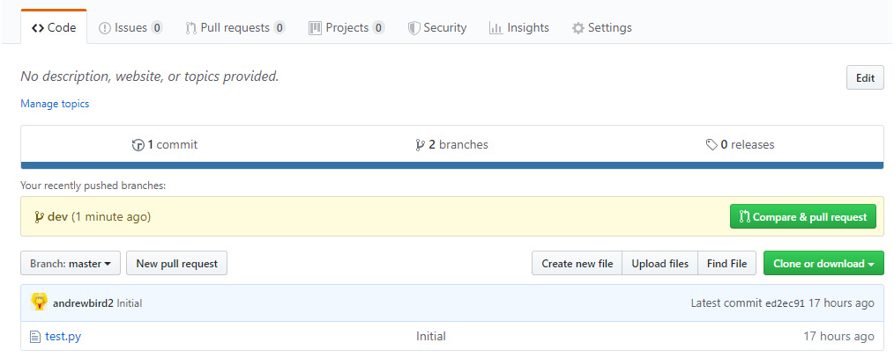


    Figure 9.5: The home page of the repository on GitHub

12. Here, you can see a list of changes made on the `dev`
    branch that you created. You can also provide an explanation that
    someone else might read when reviewing your code before deciding
    whether or not it should be committed to the master branch:

    
    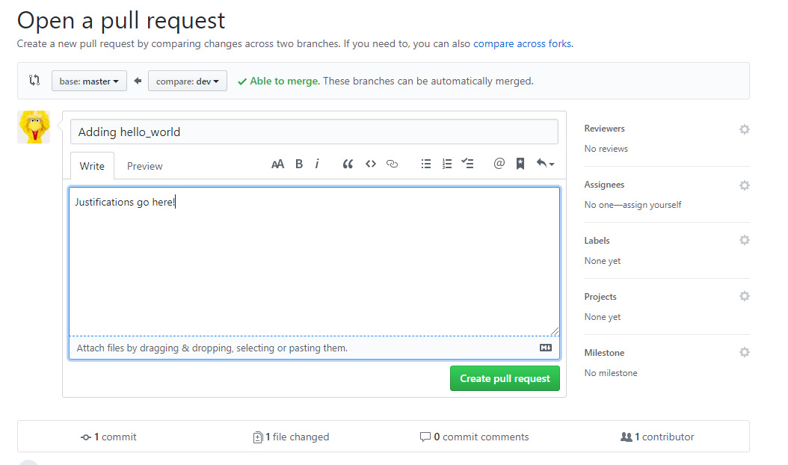


    Figure 9.6: Adding justifications to the code on GitHub

13. Click on **Create pull request** to add the justifications on
    GitHub.

14. Now, if working with a partner, you should switch back to the
    original repository that you own and view their `pull`
    request. You could comment on it if you have any concerns regarding
    the `commit` request; otherwise, you can simply click on
    **Merge pull request**:

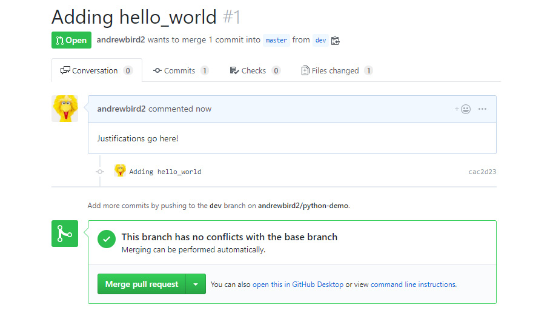


Figure 9.7: Merging a pull request

You now understand how people can work together on the same repository
on GitHub, reviewing and discussing each other\'s code before merging
into the master branch. This comes in very handy as a developer when you
want to have a single repository to store your code or help a fellow
developer located somewhere else in the world. In the next section, you
will look at dependency management.


Dependency Management
=====================


In the IT world, most complex programs depend on libraries beyond the
Python standard library. You may use `numpy` or
`pandas` to deal with multidimensional data or
`matplotlib` to visualize data in graphs (this will be covered
in *Lab 10*, *Data Analytics with pandas and NumPy*), or any number
of other libraries available to Python developers.

Just like your own software, the libraries developed by other teams
frequently change as bugs are fixed, features are added, and old code is
removed or refactored, which is the process of restructuring existing
code. That means it\'s important that your team uses the same version of
a library so that it works in the same way for all of them.

Additionally, you want your customers or the servers where you deploy
your software to use the same versions of the same libraries as well, so
that everything works the same way on their computers, too.

There are multiple tools for solving this problem. These include
`pip`, `easy_install`, `brew`, and
`conda`, to name a few. You are already familiar with
`pip`, and in some contexts, it suffices to use this package
manager to keep track of dependencies.

For instance, try running `pip freeze` in Command Prompt. You
should get the following output:

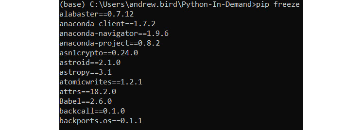


Figure 9.8: Output of pip freeze (truncated)

This package list could be saved to a `text` file with the
following command: `pip freeze` \>
`requirements.txt`. This will create a file called
`requirements.txt`, which will be similar to *Figure 9.9*:

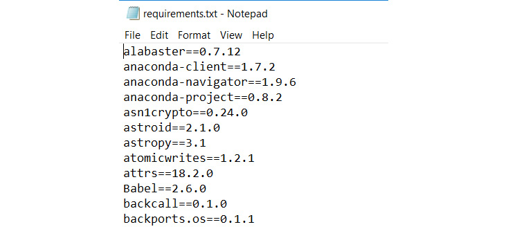


Figure 9.9: Viewing requirements.txt in Notepad (truncated)

Now that you have the information about the packages, you can choose to
install these packages on another machine or environment with the
following command: `pip install -r requirements.txt`.

In this lab, you will focus on `conda`, which provides a
complete solution for dependency management. `conda` is
particularly popular among data scientists and machine learning
programmers. For instance, some dependencies in machine learning
environments can\'t be managed by `pip`, as they might not be
a simple Python package. `conda` takes care of these for us.


Virtual Environments
--------------------

In this lab, you will use `conda` to create \"virtual
environments.\" When you code in Python, you have certain versions of
certain packages installed. You\'re also using a specific version of
Python itself, which is 3.7. However, what if you are working on two
projects, with each requiring different versions of the packages? You
would need to reinstall all of the packages when switching between these
projects, which would be a hassle. Virtual environments address this
problem. A virtual environment contains a set of particular packages at
specific versions. By switching between virtual environments, you can
switch between different packages and versions instantly. Typically, you
will have a different virtual environment for each major project you are
working on.


Exercise 118: Creating and Setting Up a conda Virtual Environment to Install numpy and pandas
---------------------------------------------------------------------------------------------

In this exercise, you\'ll create a virtual environment with
`conda` and execute some simple code to import basic
libraries. This exercise will be performed in the `conda`
environment.

Note

If you have not already installed Anaconda, refer to the *Preface*
section for installation instructions.

Now, with `conda` installed on your system, you can create a
new `conda` environment and include packages in it; for
example, `numpy`.

1.  Now you should run the following command using the
    `Anaconda Prompt` program, which is now installed on your
    computer:


    ```
    conda create -n example_env numpy
    ```

    You should get the following output:

    
    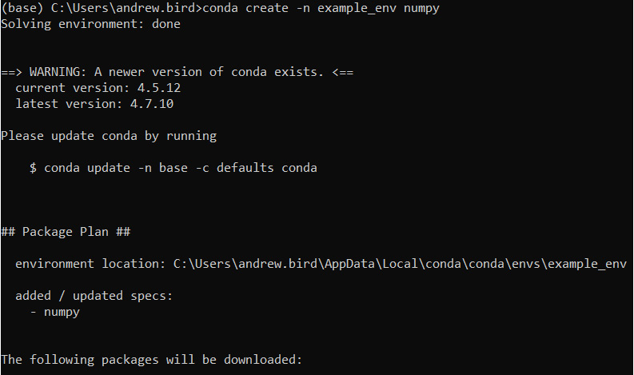


    Figure 9.10: Creating a new conda environment (truncated)

    Note

    If you are asked to enter `y/n` by the prompt, you need to
    enter `y` to proceed further.

2.  Activate the `conda` environment:


    ```
    conda activate example_env
    ```

    You can add other packages to the environment with
    `conda install`.

3.  Now, add `pandas` to the `example_env`
    environment:


    ```
    conda install pandas
    ```

    You should get the following output:

    
    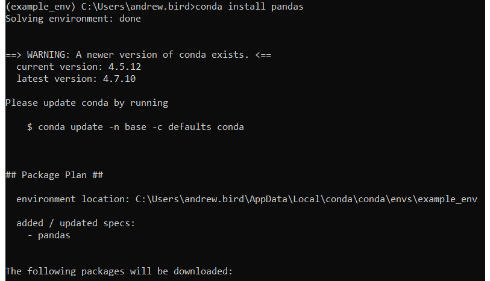


    Figure 9.11: The pandas output

    Note

    The preceding output is truncated.

4.  Next, open a Python terminal within the virtual environment by
    typing in `python` and then verify that you can import
    `pandas` as `numpy` as expected:

    ```
    python
    import pandas as pd
    import numpy as np
    ```

5.  Now, exit the Python terminal in the virtual environment using the
    `exit()` method:

    ```
    exit()
    ```

6.  Finally, deactivate the virtual environment:


    ```
    conda deactivate
    ```

    Note

    You may have noticed the `$` sign in the prompts. While
    working on the prompt, you need to ignore the `$` sign.
    The `$` sign is just to mention that the command will be
    executed on the terminal.

In this exercise, you created your first virtual environment using
`conda`, installed packages such as `numpy` and
`pandas`, and ran simple Python code to import libraries.


Saving and Sharing Virtual Environments
---------------------------------------

Now, suppose you have built an application that relies on various Python
packages. You now decide that you want to run the application on a
server, so you want a way of setting up the same virtual environment on
the server as you have running on your local machine. As you previously
encountered with `pip freeze`, the metadata defining a
`conda` environment can be easily exported to a file that can
be used to recreate an identical environment on another computer.


Exercise 119: Sharing Environments between a conda Server and Your Local System
-------------------------------------------------------------------------------

In this exercise, you will export the metadata of our
`example_env` conda environment, which you created in
*Exercise 118*, *Creating and Setting Up a conda Virtual Environment to
Install numpy and pandas*, to a `text` file and learn how to
recreate the same environment using this file.

This exercise will be performed on the `conda` environment
command line:

1.  Activate your example environment, for `example_env`:

    ```
    conda activate example_env
    ```

2.  Now, `export` the environment to a text file:


    ```
    conda env export > example_env.yml
    ```

    The `env export` command produces the text metadata (which
    is mainly just a list of Python package versions), and the
    `> example_env.yml` part of the command stores this text
    in a file. Note that the `.yml` extension is a special
    easy-to-read file format that is usually used to store configuration
    information.

3.  Now `deactivate` that environment and remove it from
    `conda`:

    ```
    conda deactivate
    conda env remove --name example_env
    ```

4.  You no longer have an `example_env` environment, but you
    can recreate it by importing the `example_env.yml` file
    you created earlier in the exercise:

    ```
    conda env create -f example_env.yml 
    ```

You have now learned how to save your environment and create an
environment using the saved file. This approach could be used when
transferring your environment between your personal computers when
collaborating with another developer, or even when deploying code to a
server.


Deploying Code into Production
==============================


You have all of the pieces now to get your code onto another computer
and get it running. You can use `PIP` (covered in *Lab 8*,
*Software Development*) to create a package, and `conda` to
create a portable definition of the environment needed for your code to
run. These tools still give users a few steps to follow to get up and
running, and each step adds effort and complexity that may put them off.

A common tool for one-command setup and installation of software is
**Docker**. Docker is based on Linux container technologies. However,
because the Linux kernel is open source, developers have been able to
make it so that Docker containers can run on both Windows and macOS.
Programmers create Docker images, which are Linux filesystems containing
all of the code, tools, and configuration files necessary to run their
applications. Users download these images and use Docker to execute them
or deploy the images into networks using `docker-compose`,
`Docker Swarm`, `Kubernetes`, or similar tools.

You prepare your program for Docker by creating a `Dockerfile`
file that tells Docker what goes into your image. In the case of a
Python application, that\'s Python and your Python code.

Firstly, you need to install Docker.

Note

The installation steps for Docker are mentioned in the Preface.

Note that after installing, you may need to restart your computer.

To test Docker, run the `hello-world` application to confirm
that Docker is correctly configured. `hello-world` is a simple
Docker application that comes as part of the standard library of Docker
apps:


``` {.language-markup}
docker run hello-world
```

You should get the following output:

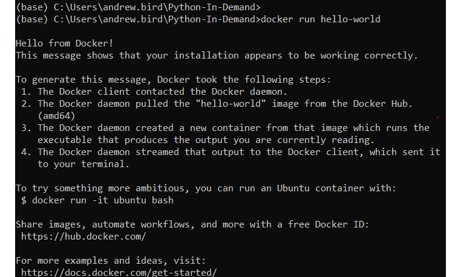


You have successfully installed and run Docker on your local machine.


Exercise 120: Dockerizing Your Fizzbuzz Tool
--------------------------------------------

In this exercise, you\'ll use Docker to create an executable version of
a simple Python script that creates a sequence of numbers. However,
instead of printing `3` or multiples of `3`, it will
print `Fizz`, and multiples of `5` will print
`Buzz`.

This exercise will be performed in the `docker` environment:

1.  Create a new directory called `my_docker_app` and
    `cd` into this directory, as shown in the following code
    snippet:

    ```
    mkdir my_docker_app
    cd my_docker_app
    ```

2.  Within this directory, create an empty file called
    `Dockerfile`. You can create this with Jupyter Notebook,
    or your favorite text editor. Ensure this file does not have any
    extensions, such as `.txt`.

3.  Now, add the first line to your `Dockerfile`:


    ```
    FROM python:3
    ```

    This line tells it to use a system that has Python 3 installed.
    Specifically, this is going to use a Python image built on top of a
    minimal Linux distribution called Alpine. More details about this
    image can be found at <https://hub.docker.com/_/python>.

4.  Next, create a `fizzbuzz.py` file in the
    `my_docker_app` directory with the following code:

    ```
    for num in range(1,101):
        string = ""
        if num % 3 == 0:
            string = string + "Fizz"
        if num % 5 == 0:
            string = string + "Buzz"
        if num % 5 != 0 and num % 3 != 0:
            string = string + str(num)
        print(string)
    ```

5.  Now `ADD` a second line to your `Dockerfile`
    file. This line tells Docker to include the `fizzbuzz.py`
    file in the application:

    ```
    ADD fizzbuzz.py /
    ```

6.  Finally, add the command that Docker must run:

    ```
    CMD [ "python", "./fizzbuzz.py" ]
    ```

7.  Your `Dockerfile` file should look like this:


    ```
    FROM python:3
    ADD fizzbuzz.py /
    CMD [ "python", "./fizzbuzz.py" ]
    ```

    Note

    This Docker output file will be saved locally on your system. You
    shouldn\'t try to access such files directly.

8.  Now build your `Docker` image. You will give it the name
    `fizzbuzz_app`:


    ```
    $ docker build -t fizzbuzz_app .
    ```

    This command created an `image` file on your system that
    contains all of the information required to execute your code in a
    simple Linux environment.

9.  Now you can run your program inside Docker:


    ```
    docker run fizzbuzz_app
    ```

    You should get the following output:

    
    


    Figure 9.13: Running your program inside Docker (truncated)

    You can see the full list of Docker images available on your system
    by running `docker images`. This list should include your
    new `fizzbuzz_app` application.

    Finally, suppose your `fizzbuzz` file imported a
    third-party library as part of the code. For example, perhaps it
    used the `pandas` library (it shouldn\'t need to). In this
    case, our code would break, because the installation of Python
    within the Docker image does not contain the pandas package.

10. To fix this, you can simply add a `pip install pandas`
    line to our `Dockerfile` file. Our updated
    `Dockerfile` file will look like this:

    ```
    FROM python:3
    ADD fizzbuzz.py /
    RUN pip install pandas
    CMD [ "python", "./fizzbuzz.py" ]
    ```

In this exercise, you installed and deployed your first application with
Docker. In the next section, you will look at multiprocessing.


Multiprocessing
===============


It\'s common to need to execute more than one thing in parallel in a
modern software system. Machine learning programs and scientific
simulations benefit from using the multiple cores available in a modern
processor, dividing their work up between concurrent threads operating
on the parallel hardware. Graphical user interfaces and network servers
do their work \"in the background,\" leaving a thread available to
respond to user events or new requests.

As a simple example, suppose your program had to execute three steps: A,
B, and C. These steps are not dependent on each other, meaning they can
be completed in any order. Usually, you would simply execute them in
order, as follows:


Figure 9.14: Processing with a single thread

However, what if you could do all of these steps at the same time,
rather than waiting for one to complete before moving onto the next? Our
workflow would look like this:


Figure 9.15: Multithreaded processing

This has the potential to be a lot faster if you have the infrastructure
to execute these steps at the same time. That is, each step will need to
be executed by a different thread.

Python itself uses multiple threads to do some work internally, which
puts some limits on the ways in which a Python program can do
multiprocessing. The three safest ways to work are as follows:

-   Find a library that solves your problem and handles multiprocessing
    for you (which has been carefully tested).
-   Launch a new Python interpreter by running another copy of your
    script as a completely separate process.
-   Create a new thread within the existing interpreter to do some work
    concurrently.

The first of these is the easiest and the most likely to be a success.
The second is fairly simple and imposes the most overhead on your
computer as the operating system is now running two independent Python
scripts. The third is very complicated, easy to get wrong, and still
creates a lot of overhead as Python maintains a Global Interpreter Lock
(GIL), which means that only one thread at a time can interpret a Python
instruction. A quick rule of thumb to choose between the three
approaches is to always pick the first one. If a library doesn\'t exist
to address your needs, then pick the second. If you absolutely need to
share memory between the concurrent processes, or if your concurrent
work is related to handling I/O, then you can choose the third
carefully.


Multiprocessing with execnet
----------------------------

It\'s possible to launch a new Python interpreter with the standard
library\'s `subprocess` module. However, doing so leaves a lot
of work up to you about what code to run and how to share data between
the \"parent\" and \"child\" Python scripts.

An easier interface is the `execnet` library.
`execnet` makes it very easy to launch a new Python
interpreter running some given code, including versions such as
`Jython` and `IronPython`, which integrate with the
Java virtual machine and .NET common language runtime, respectively. It
exposes an asynchronous communication channel between the parent and
child Python scripts, so the parent can send data that the child works
on and get on with its own thing until it\'s ready to receive the
result. If the parent is ready before the child is finished, then the
parent waits.


Exercise 121: Working with execnet to Execute a Simple Python Squaring Program
------------------------------------------------------------------------------

In this exercise, you\'ll create a `squaring` process that
receives `x` over an `execnet` channel and responds
with `x**2`. This is much too small a task to warrant
multiprocessing, but it does demonstrate how to use the library.

This exercise will be performed on a Jupyter notebook:

1.  First, install `execnet` using the `pip` package
    manager:

    ```
    $ pip install execnet
    ```

2.  Now write the `square` function, which receives numbers on
    a channel and returns their square:


    ```
    import execnet
    def square(channel):
        while not channel.isclosed():
            number = channel.receive()
            number_squared = number**2
            channel.send(number_squared) 
    ```

    Note

    Due to the way `execnet` works, you must type the
    following examples into a Jupyter notebook. You cannot type them
    into the interactive `>>>` prompt.

    The `while not channel.isclosed()` statement ensures that
    we only proceed with the calculation if there is an open channel
    between the parent and child Python processes.
    `number = channel.receive()` takes the input from the
    parent process that you want to `square`. It is then
    squared in the `number_squared = number**2` code line.
    Lastly, you send the squared number back to the parent process with
    `channel.send(number_squared)`.

3.  Now set up a `gateway` channel to a remote Python
    interpreter running that function:


    ```
    gateway = execnet.makegateway()
    channel = gateway.remote_exec(square)
    ```

    A `gateway` channel manages the communication between the
    parent and child Python processes. The channel is used to actually
    send and receive data between the processes.

4.  Now send some integers from our parent process to the child process,
    as shown in the following code snippet:


    ```
    for i in range(10):
        channel.send(i)
        i_squared = channel.receive()
        print(f"{i} squared is {i_squared}") 
    ```

    You should get the following output:

    
    


    Here, you loop through 10 integers, send them through the
    `square` channel, and then receive the result using the
    `channel.receive()` function.

5.  When you are done with the remote Python interpreter, close the
    `gateway` channel to cause it to quit:

    ```
    gateway.exit()
    ```

In this exercise, you learned how to use `execnet` to pass
instructions between Python processes. In the next section, you will be
looking at multiprocessing with the `multiprocessing` package.


Multiprocessing with the Multiprocessing Package
------------------------------------------------

The `multiprocessing` module is built into Python\'s standard
library. Similar to `execnet`, it allows you to launch new
Python processes. However, it provides an API that is lower-level than
`execnet`. This means that it\'s harder to use than
`execnet`, but affords more flexibility. An
`execnet` channel can be simulated by using a pair of
multiprocessing queues.


Exercise 122: Using the Multiprocessing Package to Execute a Simple Python Program
----------------------------------------------------------------------------------

In this exercise, you will use the `multiprocessing` module to
complete the same task as in *Exercise 121, Working with execnet to
Execute a Simple Python Squaring Program*:

1.  Create a new text file called `multi_processing.py`.

2.  Now, `import` the `multiprocessing` package:

    ```
    import multiprocessing
    ```

3.  Create a `square_mp` function that will continuously
    monitor the queue for numbers, and when it sees a number, it will
    take it, square it, and place it in the outbound queue:

    ```
    def square_mp(in_queue, out_queue):
        while(True):
            n = in_queue.get()
            n_squared = n**2
            out_queue.put(n_squared) 
    ```

4.  Finally, add the following block of code to
    `multi_processing.py`:


    ```
    if __name__ == '__main__':
        in_queue = multiprocessing.Queue()
        out_queue = multiprocessing.Queue()
        process = multiprocessing.Process(target=square_mp, args=(in_queue, out_queue))
        process.start()
        for i in range(10):
            in_queue.put(i)
            i_squared = out_queue.get()
            print(f"{i} squared is {i_squared}")
        process.terminate()
    ```

    Recall that the `if name == '__main__'` line simply avoids
    executing this section of code if the module is being imported
    elsewhere in your project. In comparison, `in_queue` and
    `out_queue` are both queue objects through which data can
    be sent between the parent and child processes. Within the following
    loop, you can see that you add integers to `in_queue` and
    get the results from `out_queue`. If you look at the
    preceding `square_mp` function, you can see how the child
    process will get its values from the `in_queue` object,
    and pass the result back into the `out_queue` object.

5.  Execute your program from the command line as follows:


    ```
    python multi_processing.py
    ```

    You should get the following output:

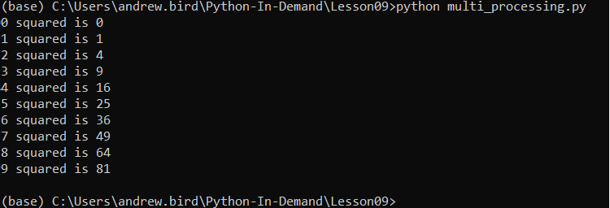


Figure 9.17: Running our multiprocessing script

In this exercise, you learned how to pass tasks between our parent and
child Python processes using the `multiprocessing` package,
and you found the square of a set of numbers.


Multiprocessing with the Threading Package
------------------------------------------

Whereas `multiprocessing` and `execnet` create a new
Python process to run your asynchronous code, threading simply creates a
new thread within the current process. It, therefore, uses fewer
operating resources than alternatives. Your new thread shares all
memory, including global variables, with the creating thread. The two
threads are not truly concurrent, because the GIL means only one Python
instruction can be running at once across all threads in a Python
process.

Finally, you cannot terminate a thread, so unless you plan to exit your
whole Python process, you must provide the `thread` function
with a way to exit. In the following exercise, you\'ll use a special
signal value sent to a queue to exit the thread.


Exercise 123: Using the Threading Package
-----------------------------------------

In this exercise, you will use the `threading` module to
complete the same task of squaring numbers as in *Exercise 121*,
*Working with execnet to Execute a Simple Python Squaring Program*:

1.  In a Jupyter notebook, `import` the `threading`
    and `queue` modules:

    ```
    import threading
    import queue
    ```

2.  Create two new queues to handle the communication between our
    processes, as shown in the following code snippet:

    ```
    in_queue = queue.Queue()
    out_queue = queue.Queue()
    ```

3.  Create the function that will watch the queue for new numbers and
    return squared numbers. The `if n == 'STOP'` line allows
    you to terminate the thread by passing `STOP` into the
    `in_queue` object:

    ```
    def square_threading():
        while True:
            n = in_queue.get()
            if n == 'STOP':
                return
            n_squared = n**2
            out_queue.put(n_squared)
    ```

4.  Now, create and start a new thread:

    ```
    thread = threading.Thread(target=square_threading)
    thread.start() 
    ```

5.  Loop through `10` numbers, pass them into the
    `in_queue` object, and receive them from the
    `out_queue` object as the expected output:


    ```
    for i in range(10):
        in_queue.put(i)
        i_squared = out_queue.get()
        print(f"{i} squared is {i_squared}")
    in_queue.put('STOP')
    thread.join()
    ```

    You should get the following output:


Figure 9.18: Output from the threading loop

In this exercise, you learned how to pass tasks between our parent and
child Python processes using the threading package. In the next section,
you will look at parsing command-line arguments in scripts.


Parsing Command-Line Arguments in Scripts
=========================================


Scripts often need input from their user in order to make certain
choices about what the script does or how it runs. For instance,
consider a script to train a deep learning network used for image
classification. A user of this script will want to tell it where the
training images are, what the labels are, and may want to choose what
model to use, the learning rate, where to save the trained model
configuration, and other features.

It\'s conventional to use command-line arguments; that is, values that
the user supplies from their shell or from their own script when running
your script. Using command-line arguments makes it easy to automate
using the script in different ways and will be familiar to users who
have experience of using the Unix or Windows command shells.

Python\'s standard library module for interpreting command-line
arguments, `argparse`, supplies a host of features, making it
easy to add argument handling to scripts in a fashion that is consistent
with other tools. You can make arguments required or optional, have the
user supply values for certain arguments, or define default values.
`argparse` creates usage text, which the user can read using
the `--help argument`, and checks the user-supplied arguments
for validity.

Using `argparse` is a four-step process. First, you create a
`parser` object. Second, you add arguments your program
accepts to the `parser` object. Third, tell the
`parser` object to parse your script\'s `argv`
(short for argument vector, the list of arguments that were supplied to
the script on launch); it checks them for consistency and stores the
values. Finally, use the object returned from the `parser`
object in your script to access the values supplied in the arguments.

To run all of the exercises in this section, later on, you will need to
type the Python code into the `.py` files and run them from
your operating system\'s command line, not from a Jupyter notebook.


Exercise 124: Introducing argparse to Accept Input from the User
----------------------------------------------------------------

In this exercise, you\'ll create a program that uses
`argparse` to take a single input from the user called
`flag`. If the `flag` input is not provided by the
user, its value is `False`. If it is provided, its value is
`True`. This exercise will be performed in a Python terminal:

1.  Create a new Python file called `argparse_demo.py`.

2.  Import the `argparse` library:

    ```
    import argparse
    ```

3.  Create a new `parser` object, as shown in the following
    code snippet:

    ```
    parser = argparse.ArgumentParser(description="Interpret a Boolean flag.")
    ```

4.  Add an argument that will allow the user to pass through the
    `–flag` argument when they execute the program:


    ```
    parser.add_argument('--flag', dest='flag', action='store_true', help='Set the flag value to True.')
    ```

    The `store_true` action means that the parser will set the
    value of the argument to `True` if the `flag`
    input is present. If the `flag` input is not present, it
    will set the value to `False`. The exact opposite can be
    achieved using the `store_false` action.

5.  Now call the `parse_args()` method, which executes the
    actual processing of the arguments:

    ```
    arguments = parser.parse_args()
    ```

6.  Now, `print` the value of the argument to see whether it
    worked:

    ```
    print(f"The flag's value is {arguments.flag}")
    ```

7.  Execute the file with no arguments supplied; the value of
    `arguments.flag` should be `False`:


    ```
    python argparse_example.py
    ```

    You should get the following output:

    
    


    Figure 9.19: Running argparse\_demo with no arguments

8.  Run the script again, with the `--flag` argument, to set
    it to `True`:


    ```
    python argparse_demo.py –flag
    ```

    You should get the following output:

    
    


    Figure 9.20: Running argparse\_demo with the \--flag argument

9.  Now enter the following code and see the `help` text that
    `argparse` extracted from the description and
    `help` text you supplied:


    ```
    python argparse_demo.py –help
    ```

    You should get the following output:


Figure 9.21: Viewing the help text of argparse\_demo

You have successfully created a script that allows an argument to be
specified when it is executed. You can probably imagine how useful this
can often be.


Positional Arguments
--------------------

Some scripts have arguments that are fundamental to their operation. For
example, a script that copies a file always needs to know the **source**
file and **destination** file. It would be inefficient to repetitively
type out the names of the arguments; for instance,
`python copyfile.py --source infile --destination outfile`,
every time you use the script.

You can use positional arguments to define arguments that the user does
not name but always provides in a particular order. The difference
between a positional and a named argument is that a named argument
starts with a hyphen (`-`), such as `--flag` in
*Exercise 124, Introducing argparse to Accept Input from the User*. A
positional argument does **not** start with a hyphen.


Exercise 125: Using Positional Arguments to Accept Source and Destination Inputs from a User
--------------------------------------------------------------------------------------------

In this exercise, you will create a program that uses
`argparse` to take two inputs from the user:
`source` and `destination`.

This exercise will be performed in a Python terminal:

1.  Create a new Python file called `positional_args.py`.

2.  Import the `argparse` library:

    ```
    import argparse
    ```

3.  Create a new `parser` object:

    ```
    parser = argparse.ArgumentParser(description="Interpret positional arguments.")
    ```

4.  Add two arguments for the `source` and
    `destination` values:

    ```
    parser.add_argument('source', action='store', help='The source of an operation.')
    parser.add_argument('dest', action='store', help='The destination of the operation.')
    ```

5.  Call the `parse_args()` method, which executes the actual
    processing of `arguments`:

    ```
    arguments = parser.parse_args()
    ```

6.  Now, `print` the value of `arguments` so that
    you can see whether it worked:

    ```
    print(f"Picasso will cycle from {arguments.source} to {arguments.dest}")
    ```

7.  Now, execute the file while using this script with no arguments,
    which causes an error because it expects two `positional`
    arguments:


    ```
    python positional_args.py
    ```

    You should get the following output:

    
    


    Figure 9.22: Running the script with no arguments specified

8.  Try running the script and specifying two locations as the source
    and destination positional arguments.

    Note

    The arguments are supplied on the command line with no names or
    leading hyphens.


    ```
    $ python positional_args.py Chichester Battersea
    ```

    You should get the following output:


Figure 9.23: Successfully specifying two positional arguments

In this exercise, you learned how to parameterize your scripts by
accepting positional arguments using the `argparse` Python
package.


Performance and Profiling
=========================


Python is not often thought of as a high-performance language, though it
really should be. The simplicity of the language and the power of its
standard library mean that the time from idea to result can be much
shorter than in other languages with better runtime performance.

But we have to be honest. Python is not among the fastest-running
programming languages in the world, and sometimes that\'s important. For
instance, if you\'re writing a web server application, you need to be
able to handle as many network requests as are being made, and with
timeliness that satisfies the users making the requests.

Alternatively, if you\'re writing a scientific simulation or a deep
learning inference engine, then the simulation or training time can
completely dwarf the programmer time (which is your time) spent writing
the code. In any situation, reducing the time spent running your
application can decrease the cost, whether measured in dollars on your
cloud hosting bill or in milliamp-hours on your laptop battery.


Changing Your Python
--------------------

You\'ll learn how to use some of Python\'s timing and profiling tools
later on in this section. Before that, you can consider whether you even
need to do that. Taligent, an object-oriented software company in the
1990s, had a performance saying: \"*There is no code faster than no
code*.\" You can generalize that idea as follows:

*There is no work that can be done faster than doing no work*.

The fastest way to speed up your Python program can often be to simply
use a different Python interpreter. You saw earlier in this lab that
multithreaded Python is slowed down by `GIL`, which means that
only one Python thread can be executing a Python instruction at any time
in a given process. The `Jython` and `IronPython`
environments, targeting the Java Virtual Machine and .NET common
language runtime, do not have `GIL`, so they may be faster for
multithreaded programs. But there are also two Python implementations
that are specifically designed to perform better, so you\'ll look to
those for assistance in later sections.


PyPy
----

You will now look in more detail at another Python environment. It\'s
called `pypy`, and Guido van Rossum (Python\'s creator) has
said: \"*If you want your code to run faster, you should probably just
use PyPy*.\"

PyPy\'s secret is Just-in-time (JIT) compilation, which compiles the
Python program to a machine language such as `Cython` but does
it while the program is running rather than once on the developer\'s
machine (called ahead-of-time, or AOT, compilation). For a long-running
process, a JIT compiler can try different strategies to compile the same
code and find the ones that work best in the program\'s environment. The
program will quickly get faster until the best version the compiler can
find is running. Take a look at PyPy in the following exercise.


Exercise 126: Using PyPy to Find the Time to Get a List of Prime Numbers
------------------------------------------------------------------------

In this exercise, you will be executing a Python program to get a list
of prime numbers using milliamp-hours. But remember that you are more
interested in checking the amount of time needed to execute the program
using `pypy`.

This exercise will be performed in a Python terminal.

Note

You need to install `pypy` for your operating system. Go to
<https://pypy.org/download.html> and make sure to get the version that
is compatible with Python 3.7.

1.  First, run the `pypy3` command, as shown in the following
    code snippet:


    ```
    pypy3
    Python 3.6.1 (dab365a465140aa79a5f3ba4db784c4af4d5c195, Feb 18 2019, 10:53:27)
    [PyPy 7.0.0-alpha0 with GCC 4.2.1 Compatible Apple LLVM 10.0.0 (clang-1000.11.45.5)] on darwin
    Type "help", "copyright", "credits" or "license" for more information.
    And now for something completely different: ''release 1.2 upcoming''
    >>>>
    ```

    Note that you may find it easier to navigate to the folder with the
    `pypy3.exe` file and run the preceding command, instead of
    following the installation instructions to create a symlink.

2.  Press **Ctrl + D** to exit `pypy`.

    You\'re going to use the program from *Lab 7*, *Becoming
    Pythonic*, again, which finds prime numbers using the *Sieve of
    Eratosthenes method*. There are two changes that you will introduce
    here: firstly, find prime numbers up to 1,000 to give the program
    more work to do; secondly, instrument it with Python\'s
    `timeit` module so that you can see how long it takes to
    run. `timeit` runs a Python statement multiple times and
    records how long it takes. Tell `timeit` to run your Sieve
    of Eratosthenes 10,000 times (the default is 100,000 times, which
    takes a very long time).

3.  Create a `eratosthenes.py` file and enter the following
    code:

    ```
    import timeit
    class PrimesBelow:
        def __init__(self, bound):
            self.candidate_numbers = list(range(2,bound))
        def __iter__(self):
            return self
        def __next__(self):
            if len(self.candidate_numbers) == 0:
                raise StopIteration
            next_prime = self.candidate_numbers[0]
            self.candidate_numbers = [x for x in self.candidate_numbers if x %           next_prime != 0]
            return next_prime
    print(timeit.timeit('list(PrimesBelow(1000))', setup='from __main__ import   PrimesBelow', number=10000)) 
    ```

4.  Run the file with the regular Python interpreter:


    ```
    python eratosthenes.py 
    ```

    You should get the following output:


Figure 9.24: Executing with the regular Python interpreter

The number will be different on your computer, but that\'s
`17.6` seconds to execute the
`list(PrimesBelow(1000))` statement 10,000 times, or 1,760
`µs` per iteration. Now, run the same program, using
`pypy` instead of CPython:


``` {.language-markup}
$ pypy3 eratosthenes.py 
```

You should get the following output:


``` {.language-markup}
4.81645076300083
```

Here, it is 482 `µs` per iteration.

In this exercise, you will have noticed that it only takes 30% of the
time to run our code in `pypy` as it took in Python. You
really can get a lot of performance boost with very little effort, just
by switching to `pypy`.


Cython
------

A Python module can be compiled to C, with a wrapper that means it is
still accessible from other Python code. Compiling code simply means it
is taken from one language and put into another. In this case, the
compiler takes Python code and expresses it in the C programming
language. The tool that does this is called `Cython`, and it
often generates modules with lower memory use and execution time than if
they\'re left as Python.

Note

The standard Python interpreter, the one you\'ve almost certainly been
using to complete the exercises and activities in this course, is
sometimes called \"CPython.\" This is confusingly similar to \"Cython,\"
but the two really are different projects.


Exercise 127: Adopting Cython to Find the Time Taken to get a List of Prime Numbers
-----------------------------------------------------------------------------------

In this exercise, you will install `Cython`, and, as mentioned
in *Exercise 126*, you will find a list of prime numbers, but you are
more interested in knowing the amount of time it takes to execute the
code using Cython.

This exercise will be performed on the command line:

1.  Firstly, install `cython`, as shown in the following code
    snippet:

    ```
    $ pip install cython
    ```

2.  Now, go back to the code you wrote for *Exercise 8*, and extract the
    class for iterating over primes using the Sieve of Eratosthenes into
    a file, `sieve_module.py`:

    ```
    class PrimesBelow:
        def __init__(self, bound):
            self.candidate_numbers = list(range(2,bound))
        def __iter__(self):
            return self
        def __next__(self):
            if len(self.candidate_numbers) == 0:
                raise StopIteration
            next_prime = self.candidate_numbers[0]
            self.candidate_numbers = [x for x in self.candidate_numbers if x %           next_prime != 0]
            return next_prime 
    ```

3.  Compile that into a C module using `Cython`. Create a file
    called `setup.py` with the following contents:

    ```
    drom distutils.core import setup
    from Cython.Build import cythonize  
    setup(
        ext_modules = cythonize("sieve_module.py")
    )
    ```

4.  Now, on the command line, run `setup.py` to build the
    module, as shown in the following code snippet:


    ```
    $ python setup.py build_ext --inplace
    running build_ext
    building 'sieve_module' extension
    creating build
    creating build/temp.macosx-10.7-x86_64-3.7
    gcc -Wno-unused-result -Wsign-compare -Wunreachable-code -DNDEBUG -g -fwrapv -O3 -Wall -Wstrict-prototypes -I/Users/leeg/anaconda3/include -arch x86_64 -I/Users/leeg/anaconda3/include -arch x86_64 -I/Users/leeg/anaconda3/include/python3.7m -c sieve_module.c -o build/temp.macosx-10.7-x86_64-3.7/sieve_module.o
    gcc -bundle -undefined dynamic_lookup -L/Users/leeg/anaconda3/lib -arch x86_64 -L/Users/leeg/anaconda3/lib -arch x86_64 -arch x86_64 build/temp.macosx-10.7-x86_64-3.7/sieve_module.o -o /Users/leeg/Nextcloud/Documents/Python Book/Lesson_9/sieve_module.cpython-37m-darwin.so
    ```

    The output will look different if you\'re on Linux or Windows, but
    you should see no errors.

5.  Now import the `timeit` module and use it in a script
    called `cython_sieve.py`:

    ```
    import timeit
    print(timeit.timeit('list(PrimesBelow(1000))', setup='from sieve_module   import PrimesBelow', number=10000))
    ```

6.  Run this program to see the timing:


    ```
    $ python cython_sieve.py 
    ```

    You should get the following output:


    ```
    3.830873068
    ```

Here, it is 3.83 seconds, so 383 μs per iteration. That\'s a little over
40% of the time taken by the CPython version, but the `pypy`
Python was still able to run the code faster. The advantage of using
Cython is that you are able to make a module that is compatible with
CPython, so you can make your module code faster without needing to make
everybody else switch to a different Python interpreter to reap the
benefits.


Profiling
=========


Having exhausted the minimum-effort options for improving your code\'s
performance, it\'s time to actually put some work in if you need to go
faster. There\'s no recipe to follow to write fast code: if there were,
you could have taught you that in *Labs 1-8* and there wouldn\'t
need to be a section on performance now. And, of course, speed isn\'t
the only performance goal: you might want to reduce memory use or
increase the number of simultaneous operations that can be in-flight.
But programmers often use \"performance\" as a synonym for \"reducing
time to completion,\" and that\'s what you\'ll investigate here.

Improving performance is a scientific process: you observe how your code
behaves, hypothesize about a potential improvement, make the change, and
then observe it again and check that you really did improve things. Good
tool support exists for the observation steps in this process, and
you\'ll look at one such tool now: cProfile.

cProfile is a module that builds an execution profile of your code.
Every time your Python program enters or exits a function or other
callable, cProfile records what it is and how long it takes. It\'s then
up to you to work out how it could spend less time doing that. Remember
to compare a profile recorded before your change with one recorded
after, to make sure you improved things! As you\'ll see in the next
exercise, not all \"optimizations\" actually make your code faster, and
careful measurement and thought are needed to decide whether the
optimization is worth pursuing and retaining. In practice, cProfile is
often used when trying to understand why code is taking longer than
expected to execute. For example, you might write an iterative
calculation that suddenly takes 10 minutes to compute after scaling to
1,000 iterations. With cProfile, you might discover that this is due to
some inefficient function in the pandas library, which you could
potentially avoid to speed up your code.


Profiling with cProfile
-----------------------

The goal of this example is to learn how to diagnose code performance
using cProfile. In particular, to understand which parts of your code
are taking the most time to execute.

This is a pretty long example, and the point is not to make sure that
you type in and understand the code but to understand the process of
profiling, to consider changes, and to observe the effects those changes
have on the profile. This example will be performed on the command line:

1.  Start with the code you wrote in *Lab 7*, *Becoming Pythonic*,
    to generate an infinite series of prime numbers:

    ```
    class Primes:
        def __init__(self):
            self.current = 2
        def __iter__(self):
            return self
        def __next__(self):
            while True:
                current = self.current
                square_root = int(current ** 0.5)
                is_prime = True
                if square_root >= 2:
                    for i in range(2, square_root + 1):
                        if current % i == 0:
                            is_prime = False
                            break
                self.current += 1
                if is_prime:
                    return current
    ```

2.  You\'ll remember that you had to use
    `itertools.takewhile()` to turn this into a finite
    sequence. Do so to generate a large list of primes and use
    `cProfile` to investigate its performance:


    ```
    import cProfile
    import itertools
    cProfile.run('[p for p in itertools.takewhile(lambda x: x<10000, Primes())]')
    ```

    You should get the following output:

    
    


    Figure 9.25: Investigating performance with cProfile

    The `__next__()` function is called most often, which is
    not surprising as it is the iterative part of the iteration. It also
    takes up most of the execution time in the profile. So, is there a
    way to make it faster?

    One hypothesis is that the method does a lot of redundant divisions.
    Imagine that the number 101 is being tested as a prime number. This
    implementation tests whether it is divisible by 2 (no), then 3 (no),
    and then 4, but 4 is a multiple of 2, and you know it isn\'t
    divisible by 2.

3.  As a hypothesis, change the `__next__()` method so that it
    only searches the list of known prime numbers. You know that if the
    number being tested is divisible by any smaller numbers, at least
    one of those numbers is itself prime:


    ```
    class Primes2:
        def __init__(self):
            self.known_primes=[]
            self.current=2
        def __iter__(self):
            return self
        def __next__(self):
            while True:
                current = self.current
                prime_factors = [p for p in self.known_primes if current % p               == 0]
                self.current += 1
                if len(prime_factors) == 0:
                    self.known_primes.append(current)
                    return current
    cProfile.run('[p for p in itertools.takewhile(lambda x: x<10000, Primes2())]')
    ```

    You should get the following output:

    
    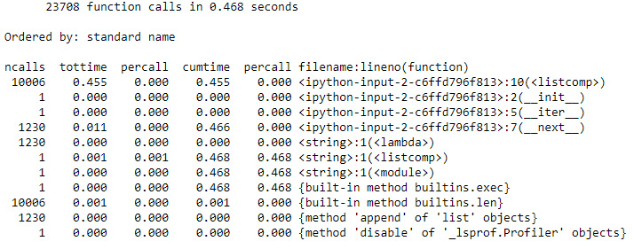


    Figure 9.26: It took longer this time!

    Now, `__next()__` isn\'t the most frequently called
    function in the profile, but that\'s not a good thing. Instead,
    you\'ve introduced a list comprehension that gets called even more
    times, and the whole process takes 30 times longer than it used to.

4.  One thing that changed in the switch from testing a range of factors
    to the list of known primes is that the upper bound of tested
    numbers is no longer the square root of the candidate prime. Going
    back to thinking about testing whether 101 is prime, the first
    implementation tested all numbers between 2 and 10. The new one
    tests all primes from 2 to 97 and is therefore doing more work.
    Reintroduce the square root upper limit, using `takewhile`
    to filter the list of primes:


    ```
    class Primes3:
        def __init__(self):
            self.known_primes=[]
            self.current=2
        def __iter__(self):
            return self
        def __next__(self):
            while True:
                current = self.current
                sqrt_current = int(current**0.5)
                potential_factors = itertools.takewhile(lambda x: x < sqrt_current, self.known_primes)
                prime_factors = [p for p in potential_factors if current % p               == 0]
                self.current += 1
                if len(prime_factors) == 0:
                    self.known_primes.append(current)
                    return current
    cProfile.run('[p for p in itertools.takewhile(lambda x: x<10000, Primes3())]')
    ```

    You should get the following output:

    
    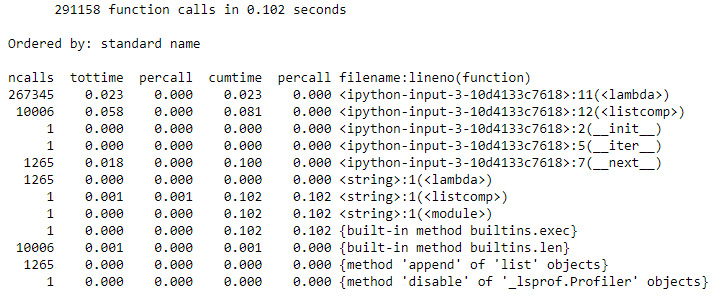


    Figure 9.27: Getting faster this time

5.  Much better. Well, much better than `Primes2` anyway. This
    still takes seven times longer than the original algorithm. There\'s
    still one trick to try. The biggest contribution to the execution
    time is the list comprehension on line 12. By turning that into a
    `for` loop, it\'s possible to break the loop early by
    exiting as soon as a prime factor for the candidate prime is found:


    ```
    class Primes4:
        def __init__(self):
            self.known_primes=[]
            self.current=2
        def __iter__(self):
            return self
        def __next__(self):
            while True:
                current = self.current
                sqrt_current = int(current**0.5)
                potential_factors = itertools.takewhile(lambda x: x < sqrt_              current, self.known_primes)
                is_prime = True
                for p in potential_factors:
                    if current % p == 0:
                        is_prime = False
                        break
                self.current += 1
                if is_prime == True:
                    self.known_primes.append(current)
                    return current
    cProfile.run('[p for p in itertools.takewhile(lambda x: x<10000, Primes4())]')
    ```

    You should get the following output:

    
    


    Figure 9.28: An even faster output

    Once again, the result is better than the previous attempt, but it
    is still not as good as the \"naive\" algorithm. This time, the
    biggest contribution to the runtime is the lambda expression on
    line 11. That tests whether one of the previously found primes is
    smaller than the square root of the candidate number. There\'s no
    way to remove that test from this version of the algorithm. In other
    words, surprisingly, in this case, doing too much work to find a
    prime number is faster than finding the minimum work necessary and
    doing just that.

6.  In fact, the good news is that our effort has not been wasted. It\'s
    don\'t recommend running this yourself unless the instructor says
    it\'s time for a coffee break, but if you increase the number of
    primes your iterator searches for, there will come the point where
    the \"optimized\" algorithm will outpace the \"naive\"
    implementation:


    ```
    cProfile.run('[p for p in itertools.takewhile(lambda x: x<10000000, Primes())]')
    ```

    You should get the following output:


Figure 9.29: The result of the naive implementation


``` {.language-markup}
cProfile.run('[p for p in itertools.takewhile(lambda x: x<10000000, Primes4())]')
```

You should get the following output:

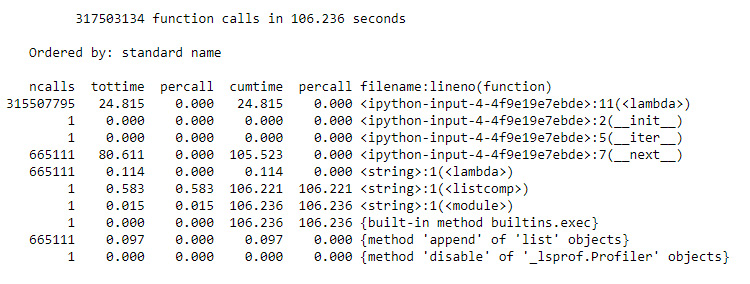


Figure 9.30: The result of the optimized implementation

By the end of this example, you were able to find the best-optimized
method to run the code. This decision was made possible by observing the
amount of time needed to run the code, allowing us to tweak the code to
address inefficiencies. In the following activity, you will put all of
these concepts together.


Activity 23: Generating a List of Random Numbers in a Python Virtual Environment
--------------------------------------------------------------------------------

You work for a sports betting website and want to simulate random events
in a particular betting market. In order to do so, your goal will be to
create a program that is able to generate long lists of random numbers
using multiprocessing.

In this activity, the aim is to create a new Python environment, install
the relevant packages, and write a function using the
`threading` library to generate a list of random numbers.

Here are the steps:

1.  Create a new `conda` environment called
    `my_env`.

2.  Activate the `conda` environment.

3.  Install `numpy` in your new environment.

4.  Next, install and run a Jupyter notebook from within your virtual
    environment.

5.  Next, create a new Jupyter notebook and `import` libraries
    such as `numpy`, `cProfile`,
    `itertools`, and `threading`.

6.  Create a function that uses the `numpy` and
    `threading` libraries to generate an array of random
    numbers. Recall that when threading, we need to be able to send a
    signal for the `while` statement to terminate. The
    function should monitor the queue for an integer that represents the
    number of random numbers it should return. For example, if the
    number `10` was passed into the queue, it should return an
    array of `10` random numbers.

7.  Next, add a function that will start a thread and put integers into
    the `in_queue` object. You can optionally print the output
    by setting the `show_output` argument to `True`.
    Make this function loop through the integers `0` to
    `n`, where `n` can be specified when the
    function is called. For each integer between `0` and
    `n`, it will pass the integer into the queue, and receive
    the array of random numbers.

8.  Run the numbers on a small number of iterations to test and see the
    output.

    You should get the following output:

    
    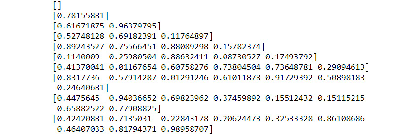


    Figure 9.31: The expected sample output

9.  Rerun the numbers with a large number of iterations and use
    `cProfile` to view a breakdown of what is taking time to
    execute.


Summary
=======


In this lab, you have seen some of the tools and skills needed to
transition from being a Python programmer to a Python software engineer.
You have learned how to collaborate with other programmers using
`Git` and GitHub, how to manage dependencies and virtual
environments with `conda`, and how to deploy Python
applications using Docker. You have explored multiprocessing and
investigated tools and techniques used for improving the performance of
your Python code. These new skills leave you better equipped to handle
the messy real world of collaborative teams working on large problems in
production environments. These skills are not just academic but are
essential tools for any aspiring Python developer to familiarize
themselves with.

The next lab begins the part of the course on using Python for data
science. You will learn about popular libraries for working with
numerical data, and techniques to import, explore, clean up, and analyze
real-world data.
